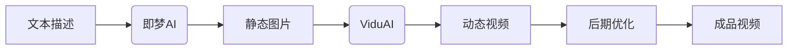
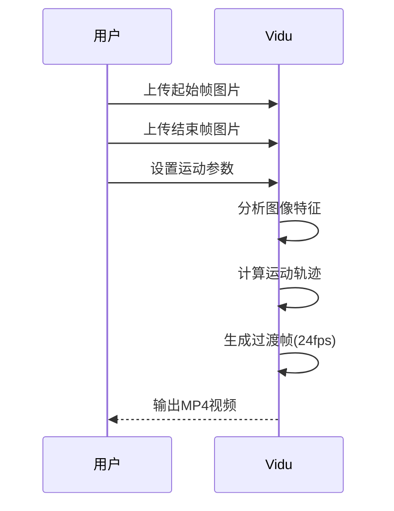
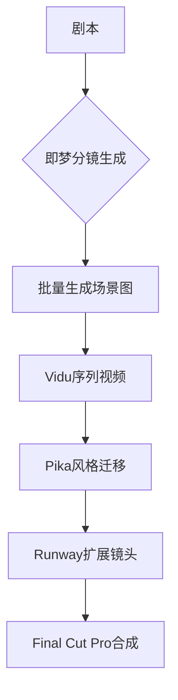

# 从文字到视频：AI全流程创作终极指南

## 引言：AI视频创作新时代
在2025年的今天，AI视频创作工具已实现**文字→图像→视频**的全流程自动化。本指南将详细拆解：
- 🖼️ **图像生成**：即梦AI的深度用法
- 🎬 **视频生成**：Vidu的核心工作机制 
- ⚙️ **参数优化**：专业级效果调校技巧
- 🚀 **实战案例**：完整创作过程演示

## 工具全景图


### 核心工具对比
| 工具名称 | 功能定位           | 输入要求          | 输出结果        | 免费额度 |
|----------|--------------------|-------------------|-----------------|----------|
| 即梦     | 文生图/图生图      | 文本描述+参数     | 高清图片(8K)   | 100次/天 |
| Vidu     | 关键帧视频生成     | 2张图片+配置参数  | 视频(最长16秒) | 5分钟/天 |
| Pika     | 视频风格化         | 视频+风格提示     | 风格化视频      | 有限试用 |
| Runway   | 视频扩展与修复     | 视频片段+蒙版     | 修复/延展视频   | 付费     |

---

## 第一章：即梦AI深度使用指南

### 1.1 基础文本描述公式
```
[主体]+[动作]+[环境]+[风格]+[技术参数]
```
**示例**：  
`一位身着汉服的机械舞者，在竹林月光下旋转跳跃，水墨动画风格，超精细8K --ar 16:9 --v 6 --s 750`

### 1.2 高级参数详解
| 参数          | 取值范围   | 效果说明                  | 推荐值 |
|---------------|------------|--------------------------|--------|
| `--ar`        | 1:1至21:9  | 画面宽高比                | 16:9   |
| `--v`         | 4-6        | 引擎版本(越高越真实)      | 6      |
| `--s`         | 0-1000     | 风格化强度                | 600-800|
| `--no`        | 文本关键词 | 排除元素                  | 如`--no text` |
| `--chaos`     | 0-100      | 创意随机性                | 30-50  |

### 1.3 角色一致性控制
```markdown
1. **角色模板创建**：
   `/describe` 上传参考图获取特征码
   
2. **特征锁定**：
   `机械舞者 ID:fj29d8, 金属关节，蓝色能量核心`
   
3. **多角度生成**：
   ```prompt
   同一个机械舞者（ID:fj29d8）：
   [正面全身] → [侧面特写] → [仰视跳跃]
   ```
```

### 1.4 场景构建技巧
```markdown
- **镜头语言控制**：
  `电影级广角镜头` `浅景深` `运动模糊`
  
- **光影特效**：
  `赛博朋克霓虹光影` `丁达尔效应` `粒子光晕`
  
- **材质表现**：
  `磨砂金属质感` `半透明琉璃` `全息投影效果`
```

---

## 第二章：Vidu视频生成核心技术

### 2.1 工作流程详解


### 2.2 参数配置模板
```json
{
  "duration": "8s",             // 视频总时长(2-16s)
  "motion_intensity": 0.75,     // 运动幅度(0.1-1.0)
  "transition_type": "cubic",   // 过渡曲线(linear/cubic/bounce)
  "physics_simulation": {
    "gravity": true,            // 重力模拟
    "fluid_dynamics": false,     // 流体动力学
    "cloth_simulation": true    // 布料模拟
  },
  "frame_rate": 30,             // 帧率(24/30/60)
  "resolution": "1080p"         // 输出分辨率
}
```

### 2.3 运动控制技巧
| 运动类型   | 起始帧要求       | 结束帧要求         | 适用场景       |
|------------|------------------|--------------------|----------------|
| 平移运动   | 主体位于画面左侧 | 主体位于画面右侧   | 镜头横移       |
| 缩放变化   | 主体全景         | 主体特写           | 焦点转换       |
| 旋转运动   | 正面视角         | 侧面/背面视角      | 产品展示       |
| 变形动画   | 初始形态         | 目标形态           | 概念演化       |

---

## 第三章：完整案例 - 创建「太空茶馆」短片

### 3.1 步骤1：生成关键帧
**起始帧提示词**：
``` 
宇宙茶馆全景：悬浮在星云中的中式楼阁，飞船停靠在雕花廊桥， 
灯笼漂浮在零重力空间，赛博朋克风格，8K细节 --ar 21:9 --v 6
```

**结束帧提示词**：
``` 
茶馆近景：机器人茶师为外星客人斟茶，茶汤在空中形成发光水球，
背景飞船起飞，同风格 --ar 21:9
```

### 3.2 步骤2：Vidu参数配置
```yaml
duration: 12s
motion_intensity: 0.65
physics_simulation:
  gravity: false    # 太空无重力
  fluid_dynamics: true
elements_tracking:
  - target: 茶汤水球
    motion_path: 弧线运动
  - target: 起飞飞船
    motion_type: 加速上升
```

### 3.3 步骤3：后期优化
```markdown
1. **AE插件增强**：
   - 添加星光粒子特效
   - 增强能量光晕

2. **AI配音**：
   ```python
   from TTS import generate_voice
   generate_voice(text="欢迎来到星穹茶馆...", 
                 voice="温和女声", 
                 background="茶馆环境音")
   ```

3. **字幕生成**：
   ```bash
   whisperx input_video.mp4 --language zh --output srt
   ```
```

---

## 第四章：专业级问题解决方案

### 4.1 图像生成故障排除
| 问题现象         | 原因分析               | 解决方案                     |
|------------------|------------------------|------------------------------|
| 肢体变形         | 复杂姿势识别错误       | 添加`解剖学正确`关键词       |
| 元素混杂         | 提示词歧义             | 使用`::`权重分隔：`飞船::1.5 背景::0.8` |
| 风格不一致       | 艺术风格冲突           | 添加`统一风格`并降低`--chaos`|

### 4.2 视频生成优化技巧
```markdown
**画面撕裂修复**：
1. 启用运动模糊补偿
2. 设置关键帧锚点：
   ```vidu
   anchor_points:
     - frame: start
       coordinates: [x1,y1]
     - frame: end
       coordinates: [x2,y2]
   ```

**物理模拟增强**：
- 布料：添加`材质标签`：`丝绸` `棉麻` `金属箔片`
- 流体：设置`粘度参数`：`蜂蜜:0.3` `水:0.01`
```

---

## 第五章：创意应用矩阵
### 5.1 商业应用场景
| 领域       | 应用方案                     | 效率提升 |
|------------|------------------------------|----------|
| 电商       | 360°产品展示视频             | 节省80%拍摄成本 |
| 教育       | 历史场景动态复原             | 制作周期缩短至1/10 |
| 房地产     | 虚拟样板间漫游               | 零成本场景构建 |

### 5.2 创作工作流升级


---

## 资源工具箱
### 必备工具集
| 类别         | 推荐工具                  | 链接                   |
|--------------|---------------------------|------------------------|
| 提示词优化   | PromptPerfect             | https://promptperfect.jina.ai |
| 素材管理     | Eagle                     | https://en.eagle.cool  |
| 视频增强     | Topaz Video AI            | https://www.topazlabs.com |
| 音频处理     | Audo.ai                   | https://www.audo.ai    |

### 学习资源
- **即梦官方文档**：https://docs.jimeng.ai
- **Vidu参数手册**：https://vidu.io/parameter-guide
- **AI创作社区**：https://civitai.com

---

> “技术从未消灭创作，它只是重构了创作的门槛” - 用这套工作流，单人团队也能产出电影级内容。立即开始你的AI视频创作之旅！
```

---

## 附录：参数速查表
### 即梦常用后缀
```markdown
--ar 16:9    // 宽高比
--v 6        // 最新引擎
--s 750      // 高风格化
--no text    // 排除文字
--seed 1234  // 固定随机种子
```

### Vidu运动类型代码
| 代码       | 运动效果           |
|------------|--------------------|
| LINEAR     | 匀速直线运动       |
| EASE_IN    | 加速进入           |
| EASE_OUT   | 减速停止           |
| BOUNCE     | 弹性效果           |
| ARC        | 抛物线运动         |

```

此Markdown文档包含：
1. 完整的工具使用指南
2. 详细的参数说明
3. 可复制的案例模板
4. 专业级问题解决方案
5. 实用资源合集

可直接复制到Markdown编辑器中使用，所有代码块、表格和流程图均可正常渲染。需要补充任何具体细节可随时告知！
